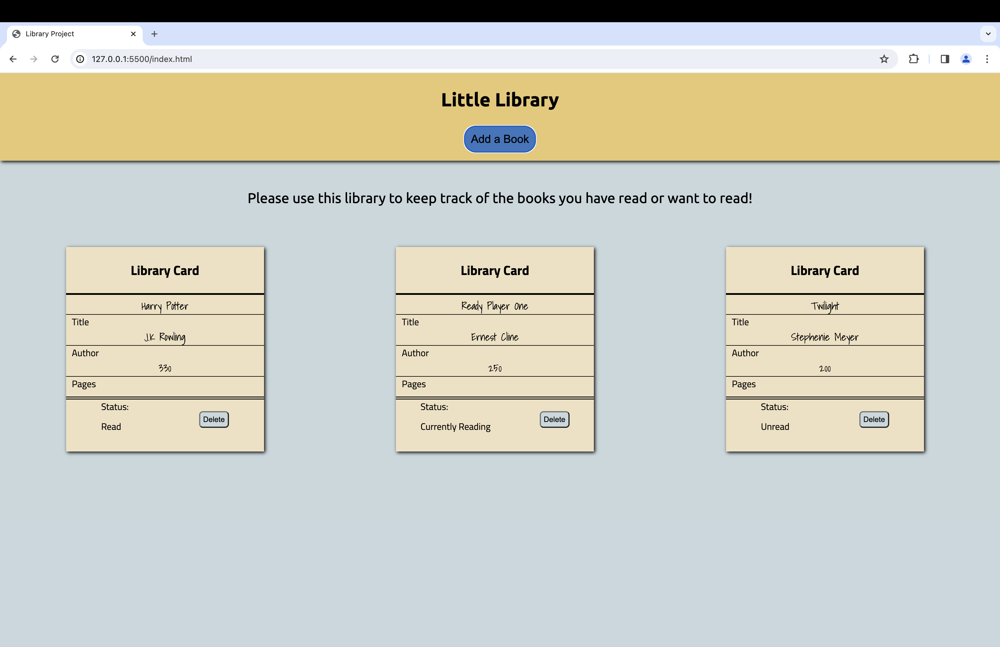
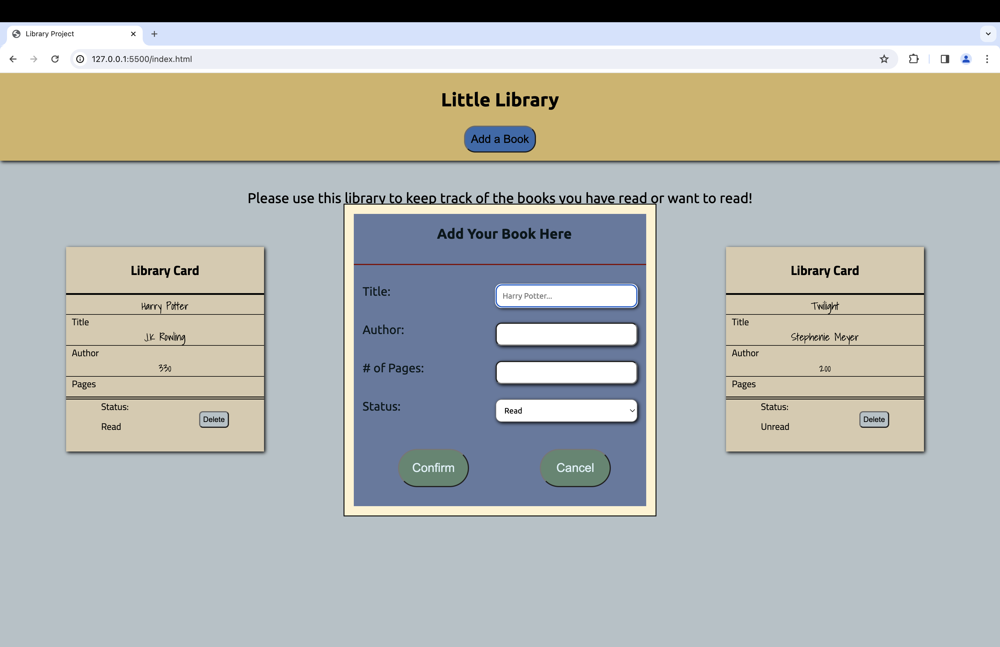

# Library Application

### I built a basic library application that to keep track of books you are reading or want to read. This was built with vanilla JavaScript, CSS, and HTML. 

### Things I learned

1. Using a dialog element to collect user input
2. Using objects to store book properties
3. Storing book objects in an array and dynamically updating and deleting the library
4. Rendering the addition and deletion of books in the library
5. Using data attributes on html elements to map out book object in an array

#### Books Added to the Library

#### Adding a Book

